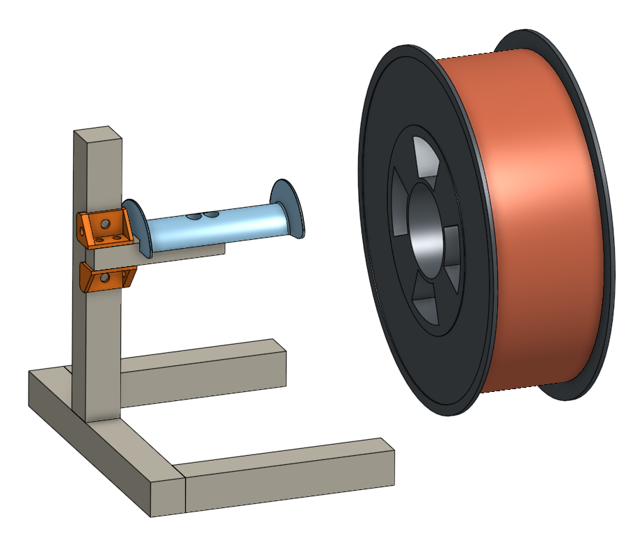

Because if I gotta cantilever, imma load cell that bitch.

Future Challenge:  load cell toilet paper holder?

# Parts

##  HX711 based load cell

Available all over the place.  Kind of touchy; be mindful of teh wiring.

##  Wemos D1 Mini/C3 Mini

Todo:  port over to C3

##  Wemos OLED Display

They discorntinued this unit.  U is can fined clones butt no has buttons  :(

##  Wemos Proto Board

Makes thing pluggable n reroute wires

##  Frame

### 2020 Extrusions n fasteners n brackets

### 3d printed mounts

### Load cell to 2020

Has a spare hole on the side for an 4mm deep M3 threaded insert

### Load cell spool mount

Make sure it doesn't make contact with the dead half of the load cell anywhere.

Also an alternate version because PLA seems have prtty hi friction against spools, esp. cardboard ones, so I wanted to make teflon surface.  butt only teflon i has is 4mm tubes, so I put some slots for those.

Recommend putting mouse ears on the four extents, n also support teh screw holes duh.  Rest should bridge OK unless ur printr suuuxx.

## Todo:  NFC tags?

Porbably want:  material, full weight, color?

